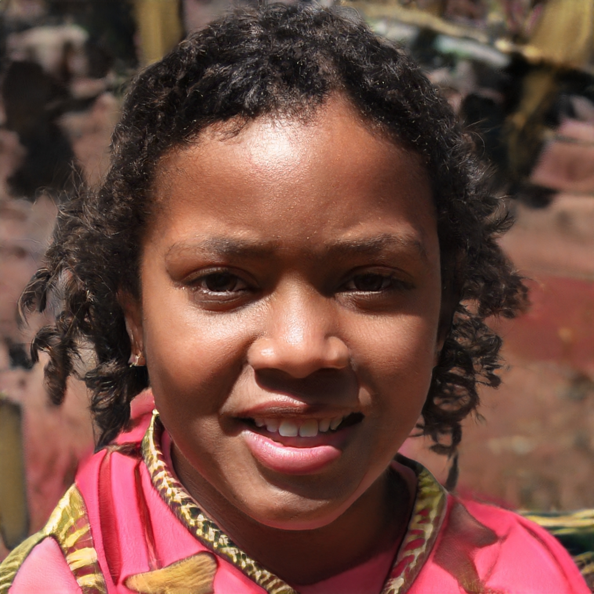

# NOTE: course still in progress, main code logic is deleted until the end of the course

# Introduction

This is Teodor-Gabriel Oprescu's (netid: 5320992) Face Morphing project for TU Delft's CS4365 Applied Image Processing course. 
[URL for GitLab Repository.](https://gitlab.ewi.tudelft.nl/cgv/cs4365/student-repositories/2023-2024/cs436523toprescu)

# Features

### Basic Features:
1. Loading 2 RGB Images: `UI.py`, starting with **line 210**. 
2. Run a pre-trained face landmark detector: `landmarks.py`, function on **line 17**.
3. Allow user to edit/add/remove landmarks: `UI.py`, function `handle_landmark(...)` at **line 109** and `generate_UI()` at **line 187**.
4. Interpolate the landmark positions: `morpher.py`,
function `create_morphed_frame(...)` at **line 171** uses the `interpolated_landmark_positions(...)` function at **line 28**. Called by `generate_morphing_animation(...)` at **line 259**.
5. Shepard Interpolation: `morpher.py`, `relative_shepard_interpolation(...)` at **line 134**
6. Project the image to a GAN: `morpher.py`, `run_projection(...)` at **line 411**
7. Repeat steps 4-7: `morpher.py`, main-loop in `generate_morphing_animation(...)` at **line 259**
8. Save the result as a video: `morpher.py`, `generate_morphing_animation(...)` at **lines 332 and 351**

### Extended Features
1. Automatic landmark densification: `landmarks.py`, 
`denisfy_landmarks(...)` at **line 45**
2. Support for objects other than faces: `UI.py`, `generate_sift_landmarks` at **line 492**

## TODO

- [ ] Reorganize function distribution throughout the files
- [ ] Explore other ML-based alternatives for SIFT
- [ ] Incorporate the Optical Flow feature
- [ ] Add GAN support for non-face things
- [ ] Refactor the code
- [ ] Dockerize the project
- [ ] Search for GAN alternatives

# Setup & Run

Clone the 2 repositories of the models that we will be using:
```bash
mkdir models
cd models
git clone https://github.com/andresprados/SPIGA.git
git clone https://github.com/NVlabs/stylegan2-ada-pytorch.git
cd ..
```

Now we need to create the conda environment and run the following command to autoinstall all of the packages required (which can be found in `reqs.txt` file).

```bash 
conda create --name <your_environment_name> --file reqs.txt
conda activate <your_environment_name>
```

Now, in order to run the application, you can use the following command:

```bash
python main.py --argument=value
```

The script accepts the following command-line arguments:

- `--no_frames`: Number of frames for the morphing animation.(default: 10)
- `--image_size`: The size of the (squared) images that the application will use. (default: 512)
- `--landmarks_path`: Path to the landmarks file, if you want to use already known/computed landmarks. (default: 'landmarks.txt')
- `--fps`: Frames per second in the final videos. (default: 30)
- `--synth_steps`: Number of training steps for the final projection. (default: 250)
- `--output_folder`: Output folder name. (default: 'output')
- `--debug`: Debug mode. (default: False)
- `--projection_frames`: Number of intermediary frames between 2 projected frames. (default: 10)

Other settings can be tweaked from the UI of the application.

!! The first time you will press the detect landmarks button, it will take a bit longer than usual. !!

# Examples

<!-- 


 -->


There are 2 example outputs present in this repository:

1. `output-face0-face2`: `face0.jpeg` and `face2.jpeg` are combined with the `debug=True` setting. The generated facial landmarks are augmented by additional landmarks on the forehead, ears, and hair and then densified so that the quality of the resulting morphing animation and that of the projection to the GAN are improved. The projection ran for 250 steps. The landmarks are saved in the `landmarks.txt` file. The results are excellent.

2. `output-chair1-chair2`: `chair1.jpg` and `chair2.jpg` are combined with the `debug=True` setting. Landmarks are generated using SIFT features. However, some pairs of landmarks are wrong so manual user input is needed to edit these pairs in the correct places. Moreover, the user adds additional landmarks to improve the morphing sequence. No densification occurs. The landmarks are saved in the `landmarks_chairs.txt` file. SIFT usually performs best when applied to the same object at different angles. In this example, however, 2 different objects are taken from the same class of objects (2 different chairs). The results are suboptimal but match my prior expectations.

# Issues

## Pytorch stalls when installing "bias_act_plugin"

In this case, please update the file `models\stylegan2adapytorch\torch_utils\custom_ops.py` and add in the `_find_compiler_bindir()` function the path to bin files of Microsoft Visual Studio, necessary for running the StyleGAN2AdaPytorch model (in my case, I added `'C:/Program Files (x86)/Microsoft Visual Studio/*/Professional/VC/Tools/MSVC/*/bin/Hostx64/x64'` to the patterns).

Additionally, remove the cache created by Pytorch. On Windows, it can be found here: `C:\Users\USERNAME\AppData\Local\torch_extensions\torch_extensions\Cache`

## Conda modules not installed

The conda environment creation should have dealt with installation of all requirements needed to run this project. If by any chance you are still getting errors related to modules not found, please run these commands:

```bash
conda install -c conda-forge tqdm  
conda install -c conda-forge imageio
```

## Landmarks generated with SPIGA look weird / are in the wrong places

Even SOTA models like SPIGA fail sometimes (so it's not my code's fault).

